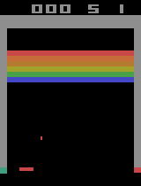

# `ale`
A Rust interface to the [Arcade Learning Environment](https://github.com/mgbellemare/Arcade-Learning-Environment).

Some games such as Breakout, Asteroids, Ms Pacman and Space Invaders are bundled into the libarary, so that anyone using it can run them. A full list can be found [here](https://github.com/trolleyman/ale-rs/blob/master/src/lib.rs#L363-L440).

## Requirements
- CMake (See [cmake-rs](https://github.com/alexcrichton/cmake-rs))

## Examples
Before running the examples you'll be required to run a command that downloads the Atari games into the local directory. This is *not* required when using this as a library via. [crates.io](https://crates.io), as they are bundled with the crate.
```bash
cargo xtask download-roms
```

### Screenshots
This example outputs the screen of the Atari to the `examples/screenshots/` folder. On Ubuntu it requires less libraries to be installed.
```bash
cargo run --release --example screenshots
```

### Breakout
For an example of the Atari playing Breakout, run this command:
```
cargo run --release --example breakout
```

Controls:
- <kbd>P</kbd>: Toggle pause
- <kbd>A</kbd>/<kbd>Left</kbd>: Move paddle left
- <kbd>D</kbd>/<kbd>Right</kbd>: Move paddle right
- <kbd>Space</kbd>: "Fire" key (trigger ball)
- <kbd>R</kbd>: Reset game

On Ubuntu you'll require `pkg-config` and the X11 development libraries.
```bash
sudo apt install pkg-config libx11-dev
```

If everything goes to plan, you should see something like this:



# `ale-sys`
Rust bindings to the [Arcade Learning Environment](https://github.com/mgbellemare/Arcade-Learning-Environment), with a few tweaks. See https://github.com/trolleyman/Arcade-Learning-Environment.

Differences:
- `zlib` is vendored so that compilation is easier
- The C library is statically linked

# `xtask`
`xtask` is a small sub-project used for development. Subcommands can be run by running `cargo xtask <subcommand>` in the root of the repository.

There are two subcommands: `gen-bindings` and `download-roms`.

`gen-bindings` generates the [`ale-sys/src/bindings.rs`](ale-sys/src/bindings.rs) file, and requires clang to be installed.

`download-roms` downloads the bundled Atari ROMs and outputs them in the `roms/` folder, that is then included in the binary via. `include_bytes!`. This is meant to protect me against copyright infringement. It's a similar technique used by [`atari-py`](https://github.com/openai/atari-py).
